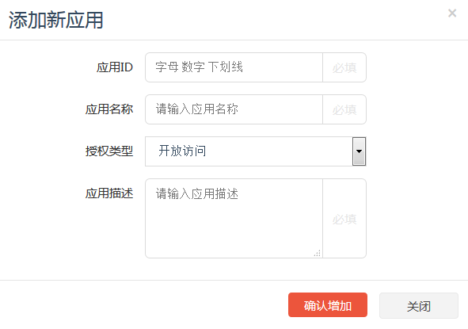

# 
用友有信WEB_SDK集成指南
 #
感谢您使用**用友有信**，本文档将会详细为您讲述WEB_SDK的使用方法以及集成方案。 
用户体系是APP当中的核心数据，也是APP中的绝对机密。用友致力于企业级软件多年，深知数据保密的重要性，所以用友IM中不保存任何APP的用户信息，也不想知道这些信息，比如CRM的APP，此APP中的用户姓名，账号，密码，电话，email等信息是保存到CRM自己的服务器中的，在使用用友IM服务时，无需把用户体系上传到用友IM服务器中。
用友服务希望以最友好的方式将IM嵌入到第三方APP中，反对暴力接入，第三方APP也无需为此改变自己的架构。
目前用友IM提供开放注册和授权注册两种用户接入的方式，每个APP可按照实际需要单独设置，也可进行调整。 

1.开放注册:
如果APP设置成开放注册模式，在使用用友IM服务时，无需事先导入用户体系，在客户端集成IM之后，用户在首次登陆时会被自动创建。

2、授权注册:
如果APP设置成授权注册模式，在使用用友IM服务时，需要事先导入用户体系或者使用REST API事先同步用户体系，在用户登录认证时，只有已集成到用户才视为合法用户。

当然，从隐私到角度来说，在使用此模式时，不必将自己的用户原账号导入到用友IM中，可在导入前做加密，只要保证此加密后的用户账号在APP内的唯一性即可。 

## 1.集成准备

### 1.1.注册开发者账号
在用友有信官网[ <https://im.yyuap.com/>](https://im.yyuap.com "用友有信") 上方点击“注册”，请按界面流程提示进行开发者账号注册。

### 1.2.创建应用
使用开发者账号登录到管理后台，点击页面上方“应用管理”，进入到应用管理。
点击左侧“新增应用”，输入应用信息即可创建，如图所示：

在应用概况中你可以查看应用的信息，我们会在客户端使用到“应用ID”和“企业ID”，在服务端进行获取token服务时使用到“ClientID”和“ClientSecret”，如果忘记了可以在这里查看。

### 1.3.在APP的Server端获取用友有信token
用友有信使用token进行用户验证

在APP的Server端需要新增一个获取token的服务，供客户端调用，在服务中需要调用用友有信“获取用户token”的接口获得token并返回给客户端。

用友有信使用应用的ClientID和ClientSecret获取应用访问的token,接口描述：
    
<table>
<tr>
	<td>Path</td>
    <td> rest/{etpId}/{appId}/token 其中etpId为企业ID，即申请帐号时的输入的企业ID; appId为应用ID, 可在管理后台的应用列表页查看</td>
</tr>

<tr>
	<td>HTTP Method</td>
    <td>POST</td>
</tr>

<tr>
	<td>URL Params</td>
    <td>无</td>
</tr>

<tr>
	<td>Request Headers</td>
    <td>{"Content-Type":"application/json"}</td>
</tr>

<tr>
	<td>Request Body</td>
    <td>"username":"获取token用户的用户名称", "clientId": "{app的ClientID}","clientSecret": "{app的ClientSecret}", "nickname":"昵称（可选）"}， 其中nickname为可选参数，仅在应用为开放模式下使用，如果提供了nickname且用户已经存在的情况下会更新昵称，提供了nickname且用户不存在则使用该昵称创建用户，没有提供nickname且用户存在，使用username作为nickname。</td>
</tr>

<tr>
	<td>Response Body</td>
    <td>
       <table>
         <tr><td>key</td><td>value</td></tr>
		 <tr><td>token</td><td>token值，在之后的请求中，需要将该值放置到Http Head中</td></tr>
		 <tr><td>expiration</td><td>有效时间,为从1970年1月1日到截止时间的毫秒数, 默认是24小时,在有效期内是不需要重复获取的，有效期重复获取的Token相同</td></tr>
      </table>
    </td>
</tr>

<tr>
	<td>可能的错误代码</td>
    <td> <table>
         <tr><td>错误码</td><td>错误原因</td></tr>
		 <tr><td>401</td><td>认证服务器认证失败</td></tr>
		 <tr><td>404</td><td> appId无效，应用不存在, 检查地址是否正确</td></tr>
		 <tr><td>406</td><td> clientid与appId不匹配, 检查地址和参数</td></tr>
 		 <tr><td>500</td><td> 认证过程发生错误。 </td></tr>
      </table>
   </td>
</tr>
</table>

### 1.4.下载用友有信WEB_SDK
用友有信WEB_IM下载地址：**[https://im.yyuap.com/download.html](https://im.yyuap.com/download.html "用友有信下载")** 
